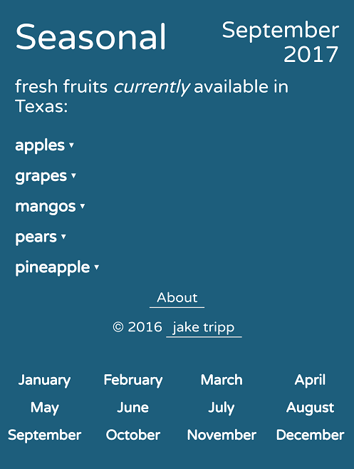

#Seasonal
#### Written in JavaScript, HTML, CSS, Bootstrap, & jQuery.

You can checkout Seasonal [here](https://jaketripp.github.io/Seasonal/ "Seasonal"). Next time you're at the grocery store, pull out your phone and buy fresh fruit with confidence!  

- - - - 

### Features:
* Easy to use application that assists in buying fresh fruit.

* Provides info such as:
 * the characteristics of an ideal fruit
 * whether the fruit continues to ripen after picked
 * which months the fruit is in season
 * health benefits of eating the fruit

- - - - 

### Screenshots:

September 2017             |  Pineapple
:-------------------------:|:-------------------------:
  |  

- - - - 
